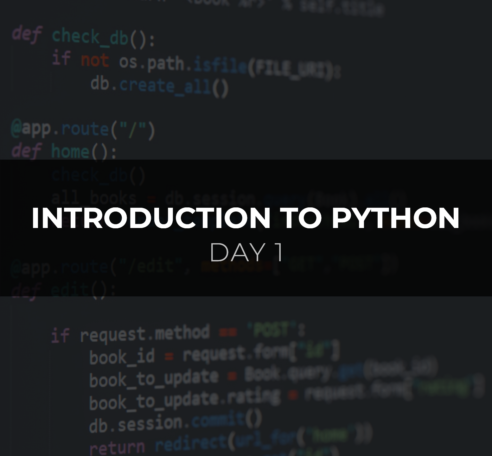

<h1 align="center">🚀30 Days of Backend🚀</h1>

Welcome to **30 Days of Backend**! 🚀 This is an exciting month-long journey that will take you deep into the heart of web development. Whether you're a seasoned coder 🧑‍💻 with years of experience or a curious newbie 🤓 eager to learn, get ready to unlock the secrets of the backend 🔐. We will explore the fundamental principles of Python, databases, APIs, and so much more.

But it's not all theory and technical jargon, we'll put our knowledge to the test by building fun, practical projects 🛠️ that showcase the power of backend development. It's a hands-on learning experience that will not only equip you with valuable skills but also inspire your creativity. So, are you ready to embark on this exciting coding journey with us?

### 📅 The 30-Day Content:

|
<h4 align='center'><a href='backend/day-01'>Introduction to Python</a></h4>
 |
<h4 align='center'><a href='backend/day-02'>Data Types</a></h4>
 |
<h4 align='center'><a href='backend/day-03'>Conditionals</a></h4>
 |
<h4 align='center'><a href='backend/day-04'>Logical Operators</a></h4>
 |
| - | - | - | - |
|
<h4 align='center'><a href='backend/day-05'>random</a></h4>
 |
<h4 align='center'><a href='backend/day-06'>Loops</a></h4>
 |
<h4 align='center'><a href='backend/day-07'>Lists and Dicts (MINI PROJECT)</a></h4>
 |
<h4 align='center'><a href='backend/day-08'>Functions</a></h4>
 |
|
<h4 align='center'><a href='backend/day-09'>Modules and Packages</a></h4>
 |
<h4 align='center'><a href='backend/day-10'>Exception Handling</a></h4>
 |
<h4 align='center'><a href='backend/day-11'>File Handling</a></h4>
 |
<h4 align='center'><a href='backend/day-12'>Classes and Objects</a></h4>
 |
|
<h4 align='center'><a href='backend/day-13'>Pillars of OOP</a></h4>
 |
<h4 align='center'><a href='backend/day-14'>Pillars of OOP (cont)</a></h4>
 |
<h4 align='center'><a href='backend/day-15'>MINI PROJECT</a></h4>
 |
<h4 align='center'><a href='backend/day-16'>Virtual Environmnent</a></h4>
 |
|
<h4 align='center'><a href='backend/day-17'>HTTP Methods</a></h4>
 |
<h4 align='center'><a href='backend/day-18'>Query Parameters</a></h4>
 |
<a href='backend/day-19'>Response Handling' width='140px'/></a><h4 align='center'><a href='backend/day-19'>Request and  Response Handling</a></h4>
 |
<h4 align='center'><a href='backend/day-20'>Server and Routing</a></h4>
 |
|
<h4 align='center'><a href='backend/day-21'>Blueprints</a></h4>
 |
<h4 align='center'><a href='backend/day-22'>Jinja</a></h4>
 |
<h4 align='center'><a href='backend/day-23'>REST APIs</a></h4>
 |
<h4 align='center'><a href='backend/day-24'>Introduction to SQLite</a></h4>
 |
|
<h4 align='center'><a href='backend/day-25'>Setting up SQLite in Flask</a></h4>
 |
<h4 align='center'><a href='backend/day-26'>Defining Databases</a></h4>
 |
<h4 align='center'><a href='backend/day-27'>CRUD</a></h4>
 |
<h4 align='center'><a href='backend/day-28'>FINAL PROJECT</a></h4>
 |