<h1 align="center">🚀CodeQuest: 30 Days of Backend🚀</h1>

Welcome to **30 Days of Backend**! 🚀 This is an exciting month-long journey that will take you deep into the heart of web development. Whether you're a seasoned coder 🧑‍💻 with years of experience or a curious newbie 🤓 eager to learn, get ready to unlock the secrets of the backend 🔐. We will explore the fundamental principles of Python, databases, APIs, and so much more.

But it's not all theory and technical jargon, we'll put our knowledge to the test by building fun, practical projects 🛠️ that showcase the power of backend development. It's a hands-on learning experience that will not only equip you with valuable skills but also inspire your creativity. So, are you ready to embark on this exciting coding journey with us?

---

### 👀 What's Inside It

This repository contains the following **main** folders:

1. **backend folder**: consisting of all the files in every day of CodeQuest. (See [The 30-Day Content](#-the-30-day-content))

2. **projects folder**: consisting of small tutorial projects in Flask that you can run locally.

3. **submissions folder**: consisting of all the necessary projects the participants need to submit to complete CodeQuest. (See [Submissions](#%EF%B8%8F-submissions))

---

### 📅 The 30-Day Content

|
<h4 align='center'><a href='backend/day-01'>Introduction to Python</a></h4>
 |
<h4 align='center'><a href='backend/day-02'>Data Types</a></h4>
 |
<h4 align='center'><a href='backend/day-03'>Conditionals</a></h4>
 |
<h4 align='center'><a href='backend/day-04'>Logical Operators</a></h4>
 |
| - | - | - | - |
|
<a href='backend/day-05'>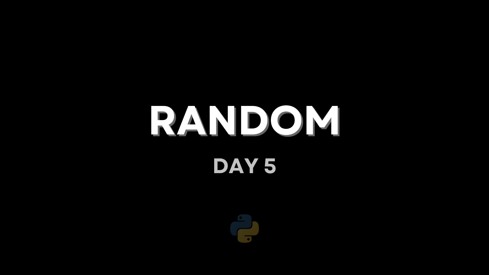</a><h4 align='center'><a href='backend/day-05'>random</a></h4>
 |
<h4 align='center'><a href='backend/day-06'>Loops</a></h4>
 |
<h4 align='center'><a href='backend/day-07'>Lists and Dicts (MINI PROJECT)</a></h4>
 |
<a href='backend/day-08'>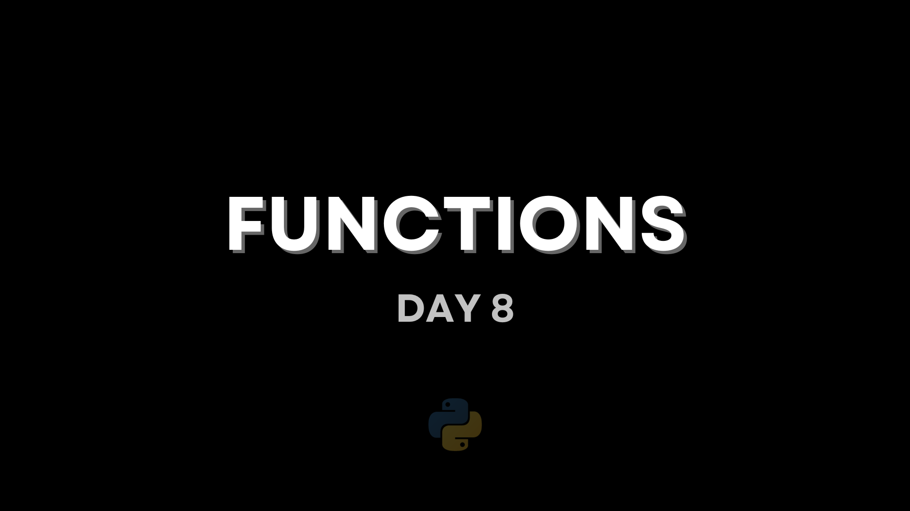</a><h4 align='center'><a href='backend/day-08'>Functions</a></h4>
 |
|
<h4 align='center'><a href='backend/day-09'>Modules and Packages</a></h4>
 |
<h4 align='center'><a href='backend/day-10'>Exception Handling</a></h4>
 |
<a href='backend/day-11'>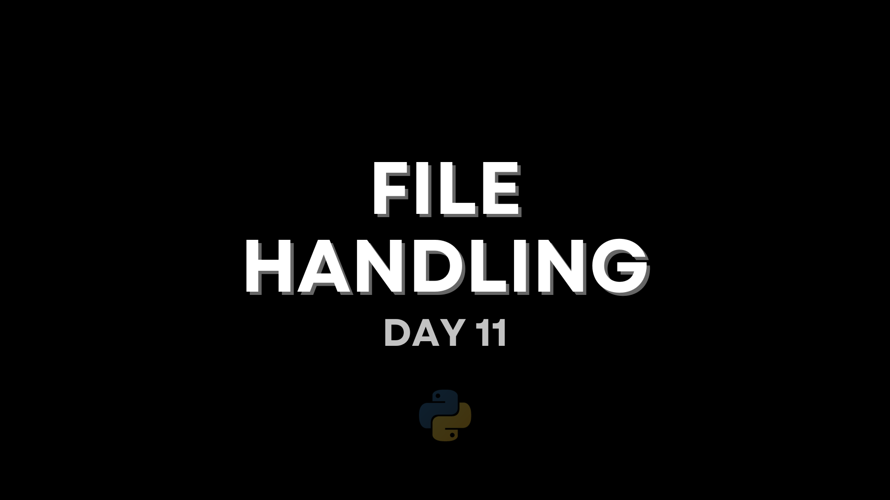</a><h4 align='center'><a href='backend/day-11'>File Handling</a></h4>
 |
<a href='backend/day-12'>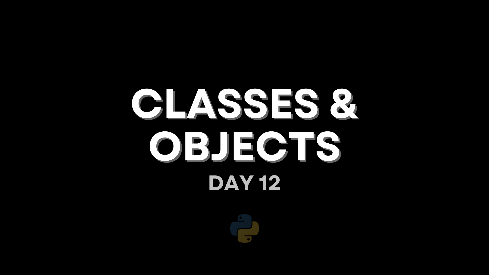</a><h4 align='center'><a href='backend/day-12'>Classes and Objects</a></h4>
 |
|
<a href='backend/day-13'>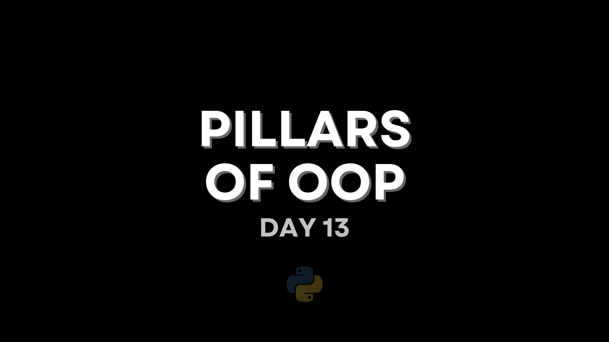</a><h4 align='center'><a href='backend/day-13'>Pillars of OOP</a></h4>
 |
<a href='backend/day-14'>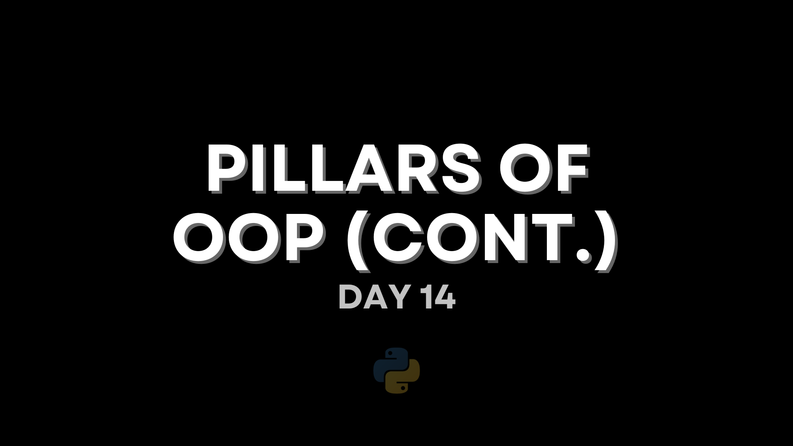</a><h4 align='center'><a href='backend/day-14'>Pillars of OOP (cont)</a></h4>
 |
<a href='backend/day-15'>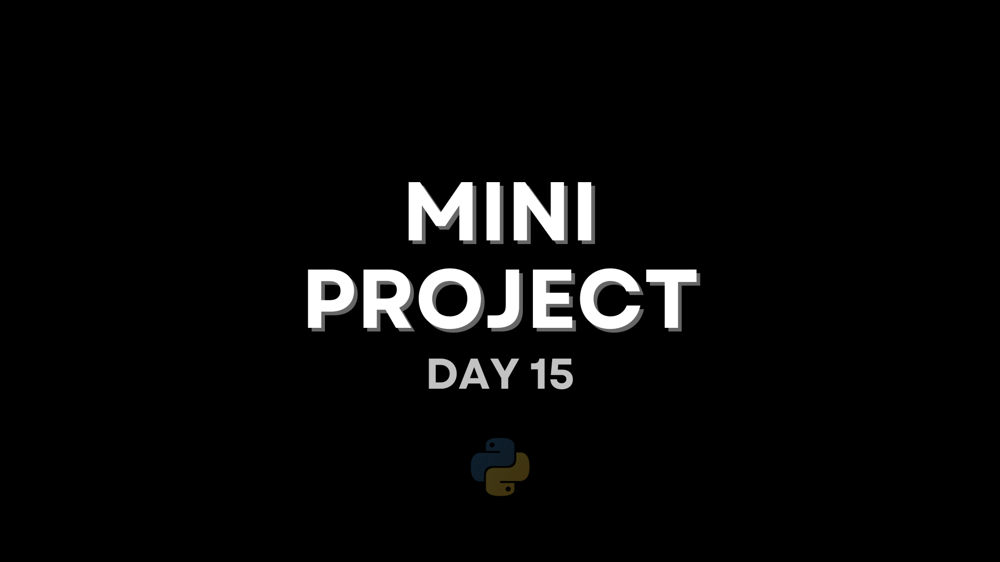</a><h4 align='center'><a href='backend/day-15'>MINI PROJECT</a></h4>
 |
<h4 align='center'><a href='backend/day-16'>Virtual Environmnent</a></h4>
 |
|
<h4 align='center'><a href='backend/day-17'>HTTP Methods</a></h4>
 |
<h4 align='center'><a href='backend/day-18'>Query Parameters</a></h4>
 |
<a href='backend/day-19'>Response Handling' width='140px'/></a><h4 align='center'><a href='backend/day-19'>Request and  Response Handling</a></h4>
 |
<h4 align='center'><a href='backend/day-20'>Server and Routing</a></h4>
 |
|
<h4 align='center'><a href='backend/day-21'>Blueprints</a></h4>
 |
<a href='backend/day-22'>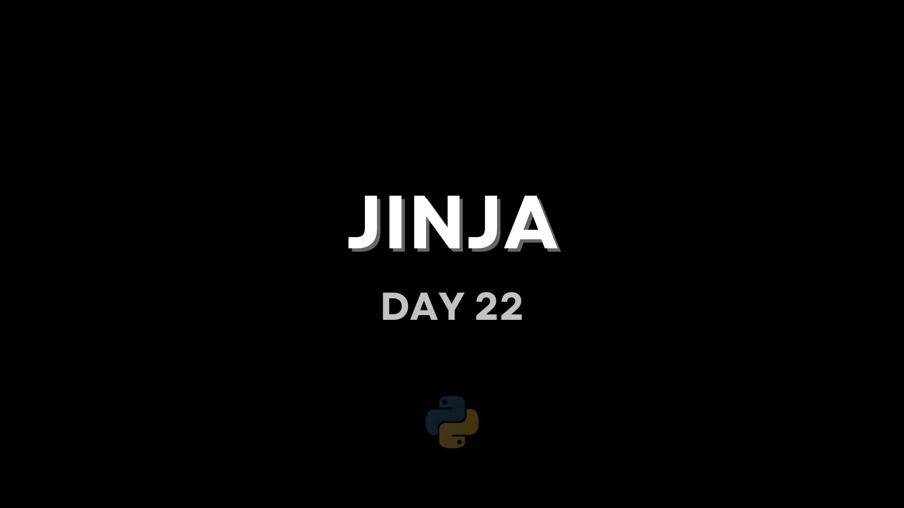</a><h4 align='center'><a href='backend/day-22'>Jinja</a></h4>
 |
<a href='backend/day-23'>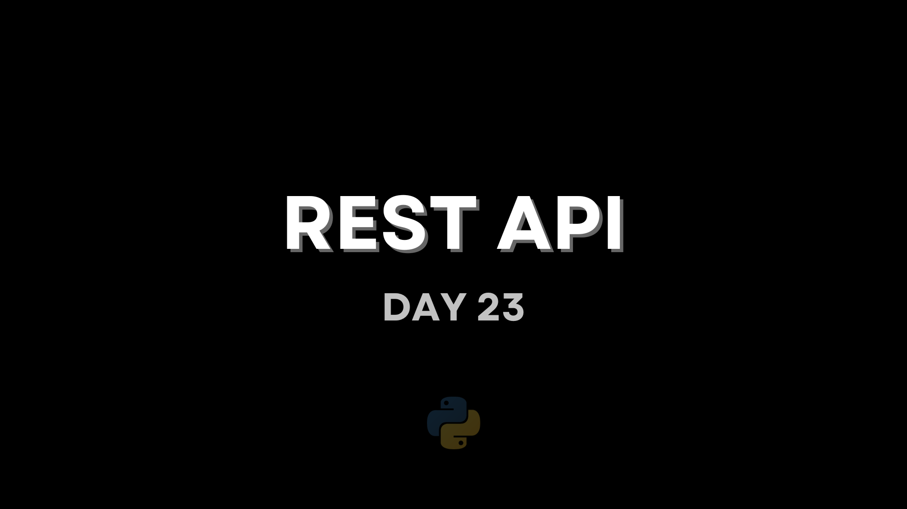</a><h4 align='center'><a href='backend/day-23'>REST APIs</a></h4>
 |
<a href='backend/day-24'>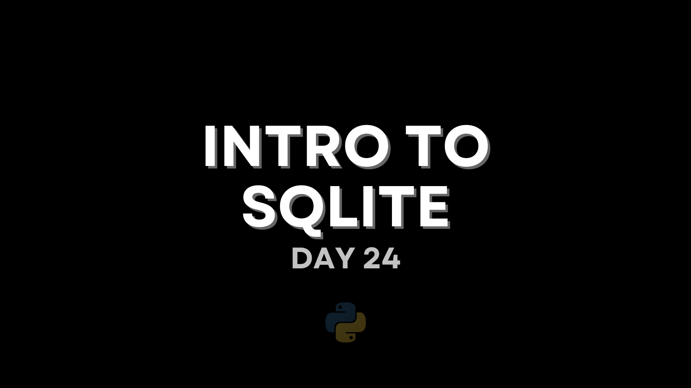</a><h4 align='center'><a href='backend/day-24'>Introduction to SQLite</a></h4>
 |
|
<a href='backend/day-25'>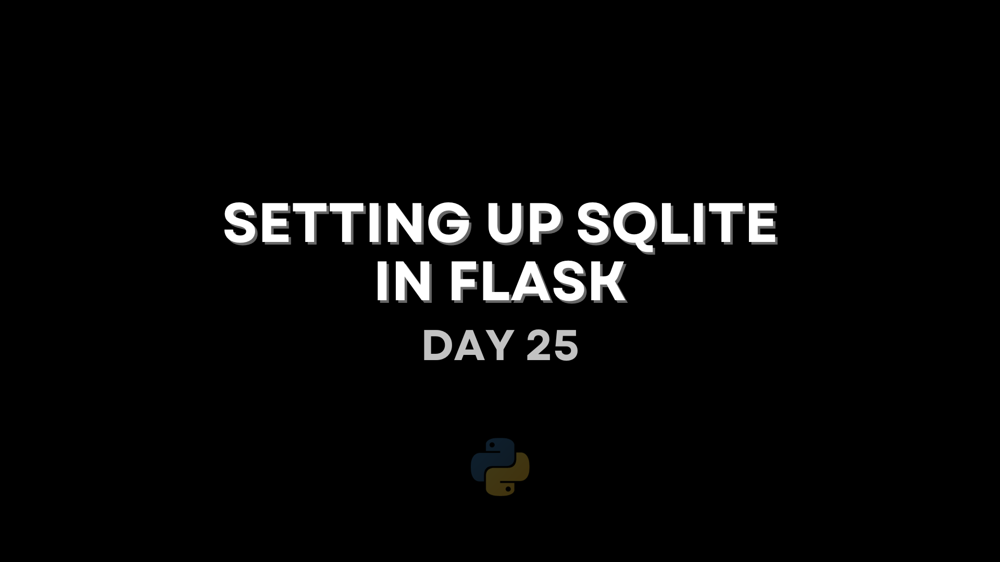</a><h4 align='center'><a href='backend/day-25'>Setting up SQLite in Flask</a></h4>
 |
<a href='backend/day-26'>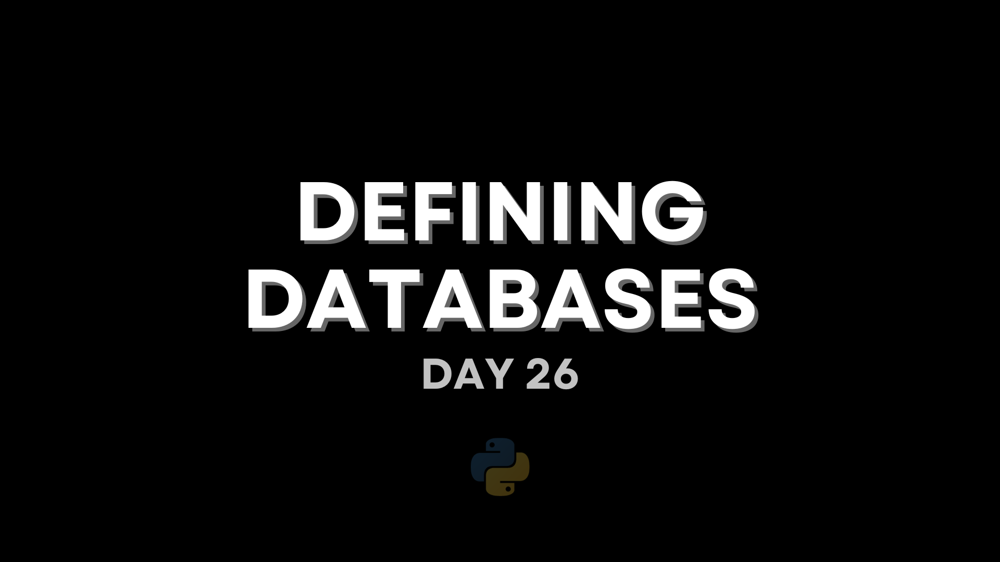</a><h4 align='center'><a href='backend/day-26'>Defining Databases</a></h4>
 |
<h4 align='center'><a href='backend/day-27'>CRUD</a></h4>
 |
<h4 align='center'><a href='backend/day-28-30'>FINAL PROJECT</a></h4>
 |

---

### 💫 Getting Started

Use this template to create your own repository with existing directory structure and files to participate in our **CodeQuest: 30 Days of Backend**.

1. On GitHub.com, navigate to the main page of this repository and click the **`Use this template`** button.

    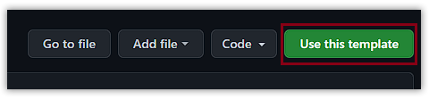

2. Name it with the same name as this repository (*AWSCC-CodeQuest-Backend*), and make it **public**.

    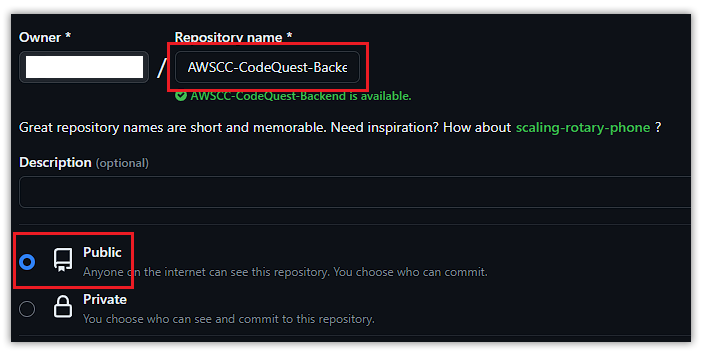

3. On the lower right, click **`Create repository`**.

    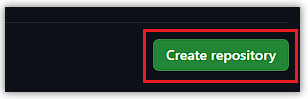

    and it should generate the repository in your account.

    

4. After creating a repository, copy the repository URL and paste it in our **[CodeQuest Tracker Sheet](https://docs.google.com/spreadsheets/d/1OsXL63ei1HblY7-gXD8uMbSoWdZJlD02mTbrjvcSsNo/edit#gid=0)** in your corresponding row.

    > Note: If you are having trouble with the CodeQuest Tracker Sheet, do not hesitate to directly message any DSWD officers or email us at awscloudclub.pupmnl.dswd@gmail.com

5. Finally, clone the repository by clicking the **`Code`** button on the top right side of the repository's main page and clicking the **`Open with GitHub Desktop`** button to redirect to your GitHub Desktop application.

    

6. And just click the **`Clone`** button to clone it to your computer.

    

---

### ✉️ Submissions

**CodeQuest** is made to provide participants an immersive, hands-on coding experience by guiding them through the creation of small projects. Every day of CodeQuest contains a particular knowledge that is essential to build the foundations of your backend development skills.

We encourage you to share your progress in [📈┊codequest-progress](https://discord.com/channels/1106592546815225878/1175409781540925521) to serve as a motivation for others and to open up discussions and reviews to gain further insights about a particular topic.

> *example*:
>
> **Day**: 11 of Backend
>
>**Topic**: File Handling
>
>**Highlights**: I learned how to open a file in Python
>
>**Attachments**: (optional)

To finish our **CodeQuest: 30 Days of Backend**, you need to submit **3** projects for your completion to be acknowledged:

    .
    ├── submission
    │   ├── mini-project-01     # mini project (day 7)
    │   ├── mini-project-02     # mini project 2 (day 15)
    │   ├── final-project       # final project (day 28-30)
    └── ...

> Note: There are exercises / challenges included in some days that you are not required to submit but is encouraged to try to test how much knowledge you've gained after finishing each day!

<h1 align='center'>Enjoy coding!~</h1>
