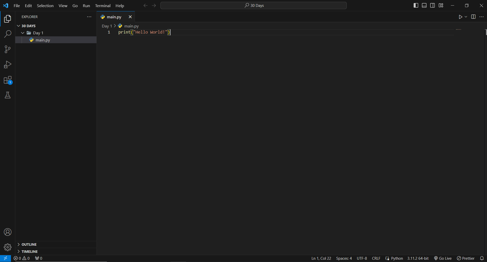

<h1 align="center">Introduction to Python</h1>
<hr>

<div align="center" style="display: flex;">
        
        <h2 align="center">So What is Python</h2>
        
    </div>
</div>

<br />

<div align="center">

</div>

- Python is a **[high-level programming language](https://en.wikipedia.org/wiki/High-level_programming_language)**, which means it is user-friendly and easy for programmers to understand and learn. Python is renowned for its readability and ease of use. It is utilized in various fields, including web development, data analysis, machine learning, and more.


#### Python Coding Environment



<br />
<br />

- There are many popular IDEs and code editors, such as IDLE, Visual Studio Code, and PyCharm, but we will be using Visual Studio Code.

- If you haven't set up VSCode and Python yet, please [follow this tutorial.](https://youtu.be/zk5qOQBvuK4?si=TTp-ot2_VN6lorua)

<hr>

<div style="display: flex; justify-content: center;">
    <div style="display: flex; align-items: center; justify-content: center; gap: 1rem; border: 1px solid white; width: fit-content;">
        
        <h2 align="center">Printing</h2>
        
    </div>
</div>

<br>

Printing in Python refers to the process of displaying text or data on the screen, typically in the console or terminal. 
In Python, you can use the `print()` function to output information, messages, variables, or any content you want to see during the program's execution. 

Here's how printing works in Python:

The `print()` function:
- Used for printing text and values to the console
- You can print text by enclosing it in either single quotes `' '`, double quotes `" "`, or triple quotes `'''  '''` or `"""     """`

```Python
# single quotes
print('Department of Software and Web Development ૮꒰ ˶• ༝ •˶꒱ა ♡')

# double quotes
print("Department of Software and Web Development ૮꒰ ˶• ༝ •˶꒱ა ♡")

# triple quotes (for multi-line strings)
print("""Department of \
Software and Web Development \
૮꒰ ˶• ༝ •˶꒱ა ♡""")
```

Output:

```
Department of Software and Web Development ૮꒰ ˶• ༝ •˶꒱ა ♡
Department of Software and Web Development ૮꒰ ˶• ༝ •˶꒱ა ♡
Department of Software and Web Development ૮꒰ ˶• ༝ •˶꒱ა ♡
```

- You can format the printed output by using the following escape characters: 
`\n`: Inserts a new line.
`\t`: Inserts a tab.
`\"` or `\'`: Escapes double or single quotes within a string.

```Python
print("Line 1\nLine 2")
print("Tabbed\tText")
print("\"Hello\" World!")
``` 

Output:
```
Line 1
Line 2
Tabbed  Text
"Hello" World
```


<hr>

<div style="display: flex; justify-content: center;">
    <div style="display: flex; align-items: center; justify-content: center; gap: 1rem; border: 1px solid white; width: fit-content;">
        
        <h2 align="center">Variables</h2>
        
    </div>
</div>

<br/>

```Python
message = "Hello World"
```

#### What are variables?

Variables are symbolic names used to store data. They are essential for data storage, flexibility, code readability, reusability, and data transformation in software development. 

When naming variables, it's important to use descriptive names that follow conventions such as using meaningful words, `camelCase` or `snake_case`, avoiding reserved words, and being consistent in your naming style. Proper variable naming enhances code readability and maintainability.

#### Variable Assignment

```Python
message = "Hello world!"
random_word = "Software"
birth_month = "March"
year_born = 2004
is_handsome = True
```

Python doesn't require you to specify the type of each variables you declare. 

This is possible because Python is doing it through a process called [type inference](https://en.wikipedia.org/wiki/Type_inference). <sup>*(While it's not necessary for you to fully understand it, it's never a bad thing that you're aware it exists.)*</sup>

The value of a variable can also be changed, here is an example:

```Python
message = "Hello World!"
print(message)
message = "Hi"
print(message)
```

Output:
```
Hello World!
Hi
```

Printing Using Variables:
- There are lots of ways we can print variables but we will be focusing on `f-strings`:

```Python
my_name = "John"
print(f"Hello, I am {my_name}. Have a wonderful day!")
```
Output:
```
Hello, I am John. Have a wonderful day!
```

F-strings are a way to create dynamic and readable text in Python. 

You can put variables and expressions inside curly braces `{}` within a string, and Python will fill in the values when the string is created. This makes it easy to generate text that changes based on data or calculations. F-strings start with `f` or `F` and are a handy feature for making your code more readable and efficient.

<hr>

<div style="display: flex; align-items: center; justify-content: center; gap: 1rem; border: 1px solid white;">

<h1 align="center">CHALLENGE TIME!!!</h1>

</div>

<br>

Based on this output try to recreate it using what you have learned today! Remember to not just print the whole thing, use variables for good practice. Replace the curly braces with whatever you like as long as it is not inappropriate. You may add more if you like.

The output should look like this:

```
Hello, I am {your_name}. I love {name_of_department} and I love being in the Backend even more!
One thing about me is that {about_you}.
```