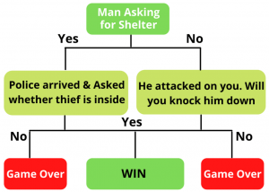

<h1 align="center">Conditional Statements</h1>
<hr>

<div align="center">

</div>

<h2 align="center">What are Conditional Statements?</h2> 

* Conditional statements in programming allow your program to make decisions based on specific conditions. These conditions are typically expressed as logical expressions or boolean values, and the program's behavior can branch in different directions depending on whether these conditions are true or false.

* It enables your program to execute different sets of instructions or code blocks depending on the situation.

* Is fundamental to writing software that can respond intelligently to varying inputs and situations, making your code more dynamic and versatile.
<br>

<hr>

### The `if` statement

* The `if` statement is a fundamental tool in programming, allowing developers to make decisions based on conditions. It enables code to execute specific blocks when particular conditions are met.

* The syntax of the `if` statement typically includes the `if` keyword followed by a condition, often followed by a colon `:`. The indented code block beneath the `if` statement is executed if the condition is true. When the condition evaluates to true, the instructions within this block are carried out.

Example:
```Python
x = 10

if x > 5:
    print("x is greater than 5")
```
Output:
```Python
x is greater than 5
```

<br>

### The `else` statement

* The `else` statement is a crucial component in programming that accompanies the `if` statement. It provides an alternative set of instructions to be executed when the condition in the `if` statement is false.

* When the condition in the `if` statement is false, the code block under the `else` statement is executed. This flexibility enables programmers to create software that responds differently to different scenarios and inputs. In practice, the `else` statement ensures that code adapts to both positive and negative outcomes.

Example:
```Python
x = 3

if x > 5:
    print("x is greater than 5")
else:
    print("x is not greater than 5")
```
Output:
```Python
x is not greater than 5
```

<br>

### The `elif` statement

* The `elif` statement, short for "else if," is a pivotal feature in programming that extends the capabilities of conditional logic. It allows programmers to sequentially evaluate and act upon multiple conditions.
 
* The syntax of the `elif` statement involves defining a series of conditions to be checked one after another, with the code blocks associated with each condition executed when that condition is true. This sequential condition testing helps create complex decision-making processes and enhances the ability of a program to handle various scenarios effectively. An `else` statement can be used at the end to provide a fallback option if none of the conditions are true.

Example:
```Python
x = 10

# Check multiple conditions using if, elif, and else
if x < 5:
    print("x is less than 5")
elif x >= 5 and x <= 15:
    print("x is between 5 and 15")
else:
    print("x is greater than 15")
```
Output:
```Python
x is between 5 and 15
```

<br><br>
#### Additional Resource:

* <a href="https://www.programiz.com/python-programming/if-elif-else">if, elif, and else statements</a>

<hr>
<br>

<h2 align="center">Mini Challenge!</h2>

<br>

Create a program where it takes a numerical input and evaluates whether it is a positive number, a negative number, or zero. You may customize it however you want.

Example Outputs:
```Python
Enter a number: -5
-5 is a Negative number!
```
```Python
Enter a number: 2
2 is a Positive number!
```
```Python
Enter a number: 0
That number is a Zero!
```

<br>
<hr>
<br>

<h2 align="center">Comparison Operators</h2>

### Greater Than: `>`

* The greater than operator `>` is used to compare two values. It returns `True` if the value on the left is greater than the value on the right. For example, `5 > 3` is `True`.
```Python
x = 5
if x > 3:
    print("x is greater than 3")
```

<br>

### Less Than: `<`

* The less than operator `<` is used to compare two values. It returns `True` if the value on the left is less than the value on the right. For example, `3 < 5` is `True`.
```Python
y = 2
if y < 7:
    print("y is less than 7")
```

<br>

### Equal To: `==` 

* The equal to operator `==` is used to compare if two values are equal. It returns `True` if the values on both sides are the same. For example, `5 == 5` is `True`, but `5 == 3` is `False`.
```Python
text = "apple"
if text == "banana":
    print("The text is 'banana'")
else:
    print("The text is not 'banana'")
```

<br>

### Not Equal To: `!=` 

* The not equal to operator `!=` is used to check if two values are not equal. It returns `True` if the values on both sides are different. For example, `5 != 3` is `True`, but `5 != 5` is `False`.
```Python
z = 8
if z != 7:
    print("z is not equal to 7")
```

<hr>
<br>

<h2 align="center">Nested `if` Statements</h2>

* Nesting `if` statements involves placing one `if` statement inside another. This creates a hierarchical structure where the inner `if` statement is executed only if the condition of the outer `if` statement is true. By doing so, you can define conditions and actions that depend on both the outer and inner conditions.

Here's a simplified example in Python to illustrate nesting "if" statements:
```Python
x = 10
y = 5

if x > 5:
    print("x is greater than 5")
    
    if y < 7:
        print("y is less than 7")
    else:
        print("y is not less than 7")
        
else:
    print("x is not greater than 5")
```

* In the code, there are two "if" statements, one inside the other. The first "if" statement checks if the value of "x" is greater than 5. If it is, the code inside this "if" statement runs. Then, within that code, there's a second "if" statement that checks if "y" is less than 7. The key idea is that the second "if" statement only runs if the first "if" statement is true.

* The reason for using this nested structure is to make decisions based on multiple conditions. Depending on the values of both "x" and "y," different parts of the code will be executed. This allows you to create more complex and detailed decision-making in your program.

<hr>
<br>

<h1 align="center">CHALLENGE TIME!!!</h1>

Create your own adventure game using everything you’ve learned so far. Try it for yourself first before going to Google or chat GPT to find answers. If you have pre-existing knowledge about functions, you may choose to utilize it to enhance your game. For those who don't have this knowledge, don't worry, as functions will be taught soon.

<br>

<div align="center">
Here is an example from google:
</div>


<div align="center">

</div>
