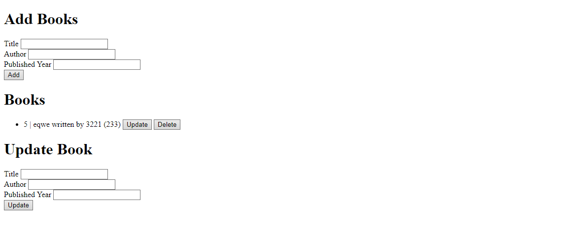

<h1 align="center">CRUD Operations in Flask</h1>

---

We have finally reached the last topic of our **CodeQuest: 30 Days of Cosmic Coding** in back-end! This day is reserved for an important topic that an aspiring back-end developer should know: **CRUD** operations.

**CRUD** stands for **C**reate, **R**ead, **U**pdate, and **D**elete. These are the four basic operations of data manipulation that a software or web application should perform. Users must, at some extent, have the permission to create, read, update, and delete a data.

Let's start creating our own CRUD app in Flask!

### CRUD in Flask

1. Create a Flask App

    We'll start with creating a Flask app:

    in a `src/__init__.py`:

    ```python
    from flask import Flask
    from flask_sqlalchemy import SQLAlchemy

    DB_NAME = "new_books.db"
    db = SQLAlchemy()

    def create_app():
        app = Flask(__name__)
        app.config['SQLALCHEMY_DATABASE_URI'] = f'sqlite:///{DB_NAME}'
        db.init_app(app)

        return app
    ```

    in your root directory `app.py`:

    ```python
    from src import create_app

    app = create_app()

    if __name__ == "__main__":
        app.run(debug=True)
    ```

    This will initialize and run a Flask app for us.

2. Create a Model and a Database

    in your `src/model.py`:

    ```python
    from . import db

    class Book(db.Model):
        id = db.Column(db.Integer, primary_key=True)
        title = db.Column(db.String(80), unique=True, nullable=False)
        author = db.Column(db.String(120), unique=True, nullable=False)
        published_year = db.Column(db.Integer, nullable=False)

        def __repr__(self):
            return f'<Book {self.title}-{self.author}>'
    ```

3. Connect to the Database

    Back to your `src/__init__.py`:

    ```python
    from flask import Flask
    from flask_sqlalchemy import SQLAlchemy
    from os import path     # <-- add this

    DB_NAME = "new_books.db"
    db = SQLAlchemy()


    def create_app():
    app = Flask(__name__)
    app.config['SQLALCHEMY_DATABASE_URI'] = f'sqlite:///{DB_NAME}'
    db.init_app(app)

    # Connect to the database:
    from .model import Book
    if not path.exists("../instance/" + DB_NAME):
        with app.app_context():
            db.create_all()
        print("Created Database!")

    return app
    ```

    The `db.create_all()` should initialize the schema that we created in the `Book` class.

4. Add Routes

    Next, we'll be creating new routes for our home page and the various request methods:

    ```python
    from flask import Blueprint, render_template
    from .model import Book
    from . import db

    views = Blueprint("views", __name__)

    @views.route("/")
    def home():
        books = Book.query.all()
        return render_template("home.html", books=books)
    ```

    The `Book.query.all()` will select all the data contained in our database.

5. Create HTML Files

    ```html
    <!DOCTYPE html>
    <html lang="en">
    <head>
        <meta charset="UTF-8">
        <meta name="viewport" content="width=device-width, initial-scale=1.0">
        <title>Document</title>
    </head>
    <body>
        <form action="/add" method="POST">
            <h1>Add Books</h1>
            <div>
                <label for="addTitle">Title</label>
                <input type="text" id="addTitle" name="title">
            </div>
            <div>
                <label for="addAuthor">Author</label>
                <input type="text" id="addAuthor" name="author">
            </div>
            <div>
                <label for="addPublishedYear">Published Year</label>
                <input type="number" max="2023" id="addPublishedYear" name="published_year">
            </div>
            <button type="submit">Add</button>
        </form>

        <h1>Books</h1>
        <ul>
            
            <li data-id={{book.id}} data-title={{book.title}} data-author={{book.author}} data-published-year={{book.published_year}}>
                {{book.id}} | {{ book.title}} written by {{ book.author}} ({{book.published_year}})
                <button class="update-btn">Update</button>
                <button class="delete-btn">Delete</button>
            </li>
            
        </ul>

        <h1>Update Book</h1>
        <div>
            <label for="updateTitle">Title</label>
            <input type="text" id="updateTitle" name="title">
        </div>
        <div>
            <label for="updateAuthor">Author</label>
            <input type="text" id="updateAuthor" name="author">
        </div>
        <div>
            <label for="updatePublishedYear">Published Year</label>
            <input type="number" max="2023" id="updatePublishedYear" name="published_year">
        </div>
        <button type="submit" id="updateBookBtn">Update</button>


        <script type="text/javascript" src="{{ url_for('static', filename='index.js')}}"></script>
    </body>
    </html>
    ```

    This uses jinja to display the books that have been queried earlier in the `home()` function and passed as a `books` variable.

    This should look like this:

    

6. Add More Routes for CRUD Operations

    If we want to add new books to the page, we will need to create a new route that will perform some SQL operations once visited with a specific HTTP method.

    ```python
    @views.route("/add", methods=["POST"])
    def add_book():
        author = request.form.get('author')
        title = request.form.get('title')
        published_year = request.form.get('published_year')
        new_book = Book(title=title, author=author, published_year=published_year)
        db.session.add(new_book)
        db.session.commit()
        return redirect(url_for('views.home'))
    ```

    This `add_book()` function will only accept `POST` requests from the client, and get all the data from the form that was passed to it.

    The `db.session.add(new_book)` will add the new book to the database, while `db.session.commit()` will save that performed action.

    The `redirect(url_for('views.home'))` performs redirection to the url of the `home()` function of the `views` Blueprint, which is the home page of the website.

    Provided below are the Update and Delete operation in separate routes.

    Update:

    ```python
    @views.route("/update/<id>", methods=["PATCH"])
    def update_book(id):
        
        # get data from form
        author = request.json.get('author')
        title = request.json.get('title')
        published_year = request.json.get('publishedYear')
        
        # updates
        book = Book.query.get(id)
        book.author = author
        book.title = title
        book.published_year = published_year
        db.session.commit()
        return ({"result": "success"})
    ```

    The `Book.query.get(id)` will get the row that matches the id passed to it. After getting the object, we can easily change its attributes using the dot notation and `db.session.commit()` to save all the changes that has been made.

    Delete:

    ```python
    @views.route("/delete/<id>", methods=["DELETE"])
    def delete_book(id):
        book = Book.query.get(id)
        if book:
            db.session.delete(book)
            db.session.commit()
            return ({"results": "success"})
        return ({"results": "error"})
    ```

    `db.session.delete(book)` will simply delete the book that was retrieved using the `Book.query.get(id)`.

There are some JavaScripts involved to make some HTTP methods happen, but the goal of understanding the CRUD operations is to know how to implement it in the back-end.

You can try running the program that we created in the `projects/day-27` folder.

### We're Done!

And we're done! You finally covered all the lessons that we can give in CodeQuest. It's now time to put everything to a test. The final project will be presented on the next day, lasting for 3 days. Good luck and have fun!

### Additional Resources

- [CRUD Operations – What is CRUD?](https://www.freecodecamp.org/news/crud-operations-explained/)

- [Flask CRUD Application – Create, Retrieve, Update, and Delete](https://www.askpython.com/python-modules/flask/flask-crud-application)

- [How to Build a CRUD App with Flask and SQLAlchemy in Python](https://thepythoncode.com/article/building-crud-app-with-flask-and-sqlalchemy)
