|
<a href='backend/day-1'>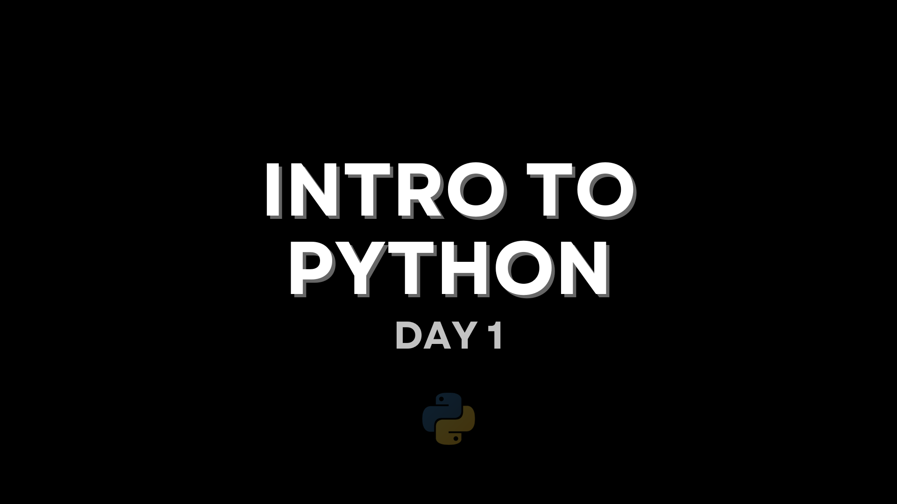</a><h4 align='center'><a href='backend/day-1'>Introduction to Python</a></h4>
 |
<a href='backend/day-2'>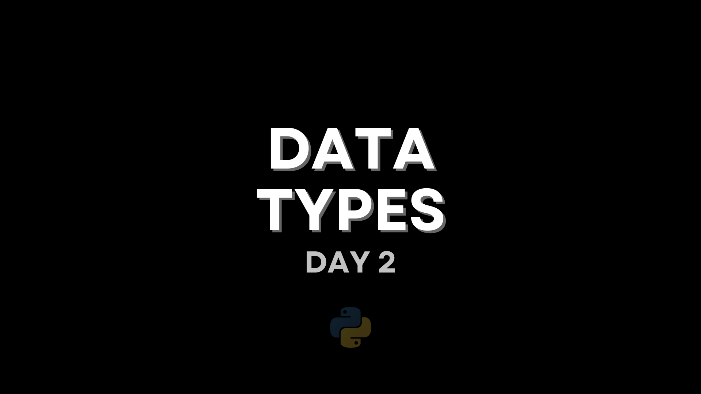</a><h4 align='center'><a href='backend/day-2'>Data Types</a></h4>
 |
<a href='backend/day-3'>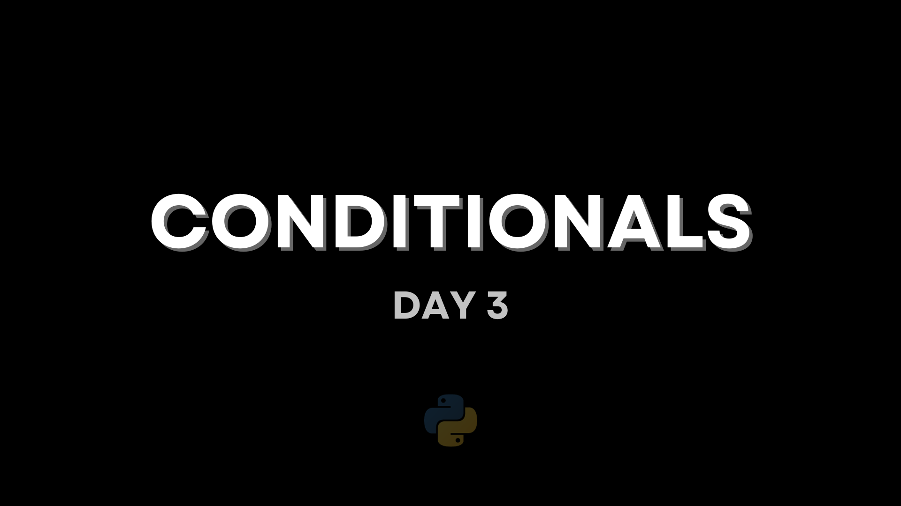</a><h4 align='center'><a href='backend/day-3'>Conditionals</a></h4>
 |
<a href='backend/day-4'>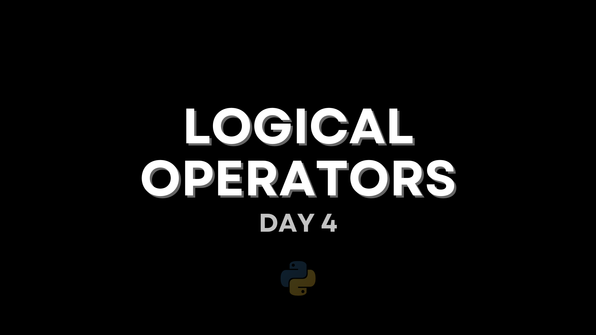</a><h4 align='center'><a href='backend/day-4'>Logical Operators</a></h4>
 |
| - | - | - | - |
|
<h4 align='center'><a href='backend/day-5'>random</a></h4>
 |
<a href='backend/day-6'>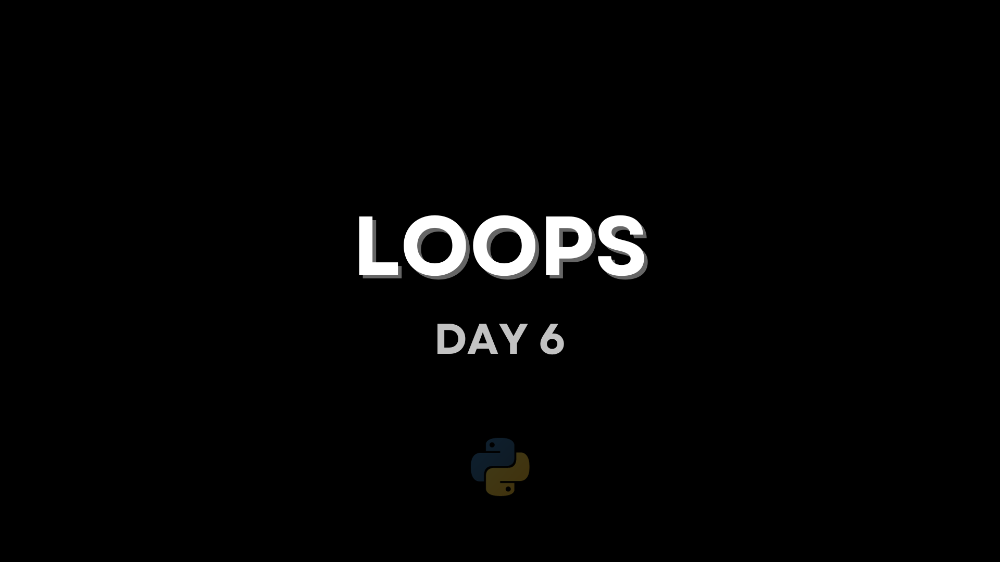</a><h4 align='center'><a href='backend/day-6'>Loops</a></h4>
 |
<a href='backend/day-7'>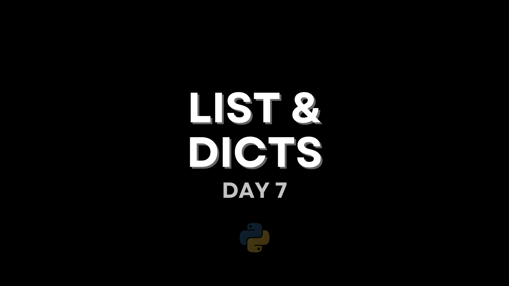</a><h4 align='center'><a href='backend/day-7'>Lists and Dicts (MINI PROJECT)</a></h4>
 |
<h4 align='center'><a href='backend/day-8'>Functions</a></h4>
 |
|
<a href='backend/day-9'>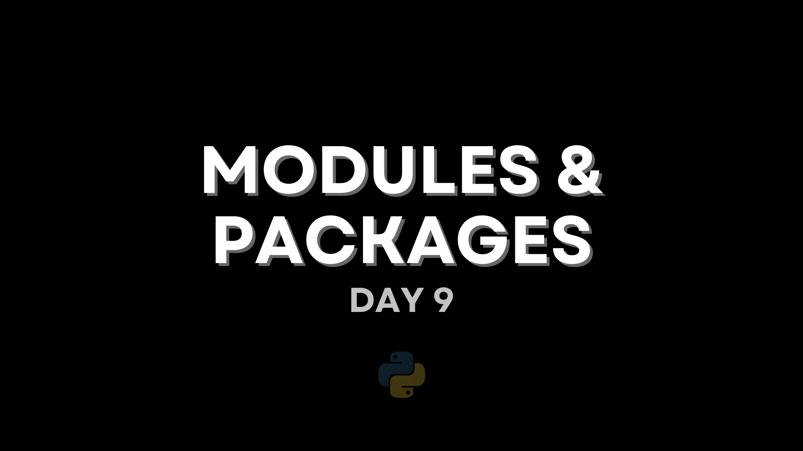</a><h4 align='center'><a href='backend/day-9'>Modules and Packages</a></h4>
 |
<a href='backend/day-10'>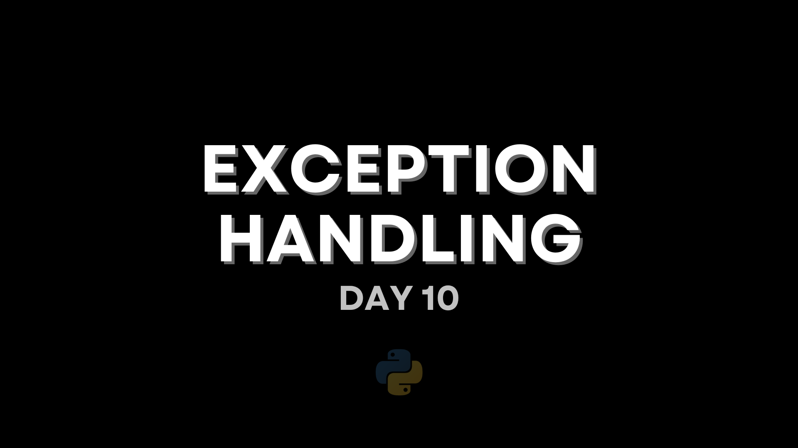</a><h4 align='center'><a href='backend/day-10'>Exception Handling</a></h4>
 |
<h4 align='center'><a href='backend/day-11'>File Handling</a></h4>
 |
<h4 align='center'><a href='backend/day-12'>Classes and Objects</a></h4>
 |
|
<h4 align='center'><a href='backend/day-13'>Pillars of OOP</a></h4>
 |
<h4 align='center'><a href='backend/day-14'>Pillars of OOP (cont)</a></h4>
 |
<h4 align='center'><a href='backend/day-15'>MINI PROJECT</a></h4>
 |
<a href='backend/day-16'>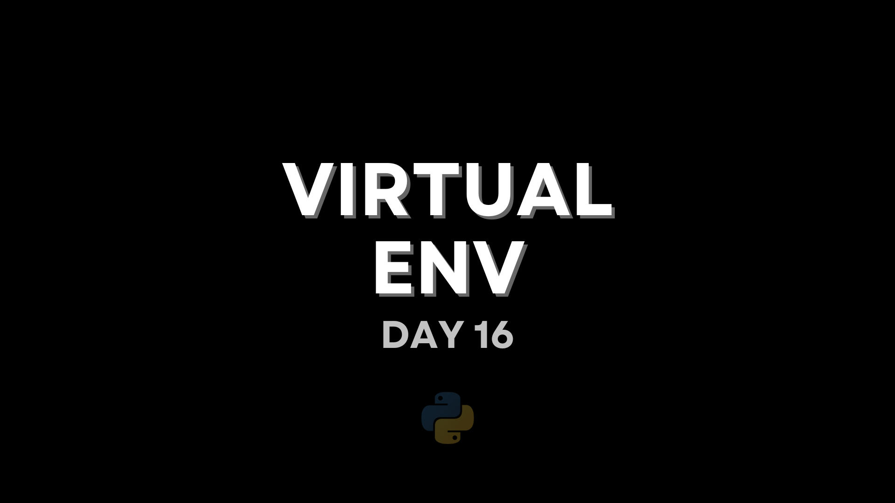</a><h4 align='center'><a href='backend/day-16'>Virtual Environmnent</a></h4>
 |
|
<h4 align='center'><a href='backend/day-17'>HTTP Methods</a></h4>
 |
<a href='backend/day-18'>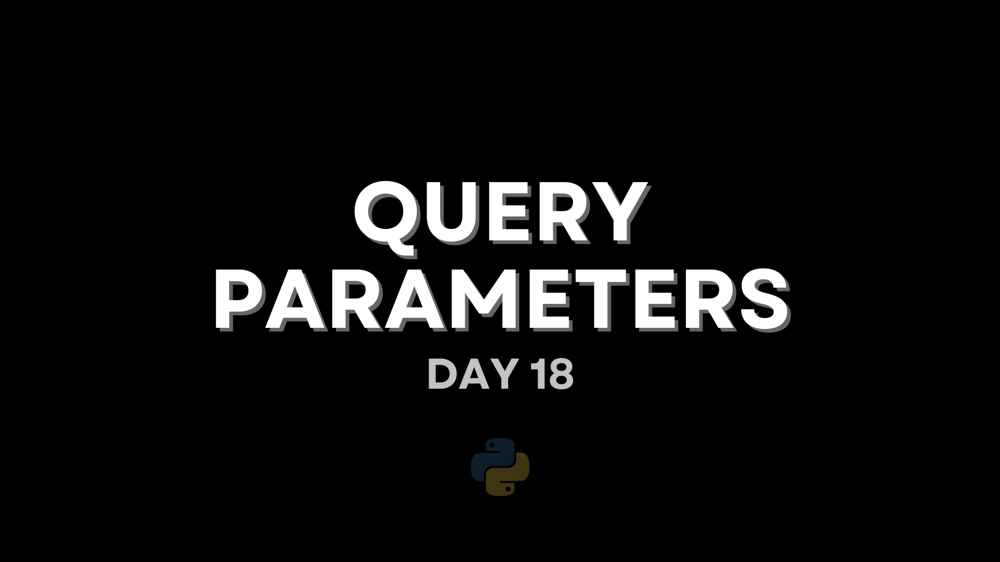</a><h4 align='center'><a href='backend/day-18'>Query Parameters</a></h4>
 |
<a href='backend/day-19'>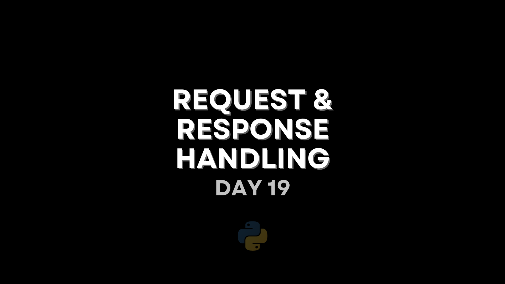Response Handling' width='140px'/></a><h4 align='center'><a href='backend/day-19'>Request and  Response Handling</a></h4>
 |
<a href='backend/day-20'>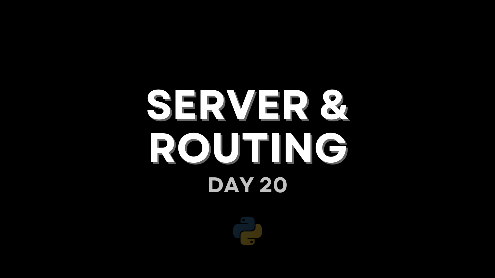</a><h4 align='center'><a href='backend/day-20'>Server and Routing</a></h4>
 |
|
<a href='backend/day-21'>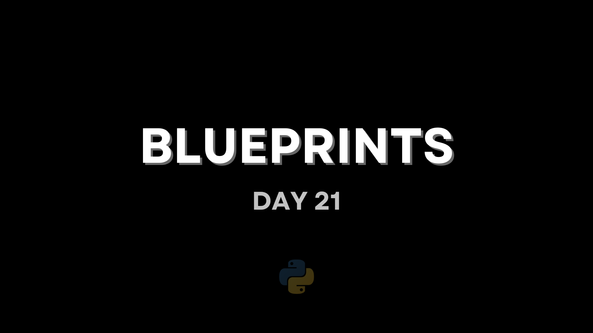</a><h4 align='center'><a href='backend/day-21'>Blueprints</a></h4>
 |
<h4 align='center'><a href='backend/day-22'>Jinja</a></h4>
 |
<h4 align='center'><a href='backend/day-23'>REST APIs</a></h4>
 |
<h4 align='center'><a href='backend/day-24'>Introduction to SQLite</a></h4>
 |
|
<h4 align='center'><a href='backend/day-25'>Setting up SQLite in Flask</a></h4>
 |
<h4 align='center'><a href='backend/day-26'>Defining Databases</a></h4>
 |
<a href='backend/day-27'>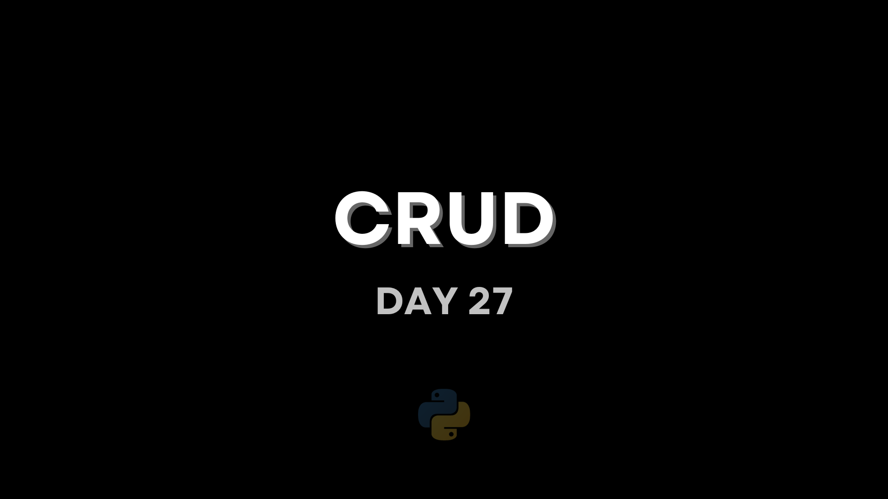</a><h4 align='center'><a href='backend/day-27'>CRUD</a></h4>
 |
<a href='backend/day-28'>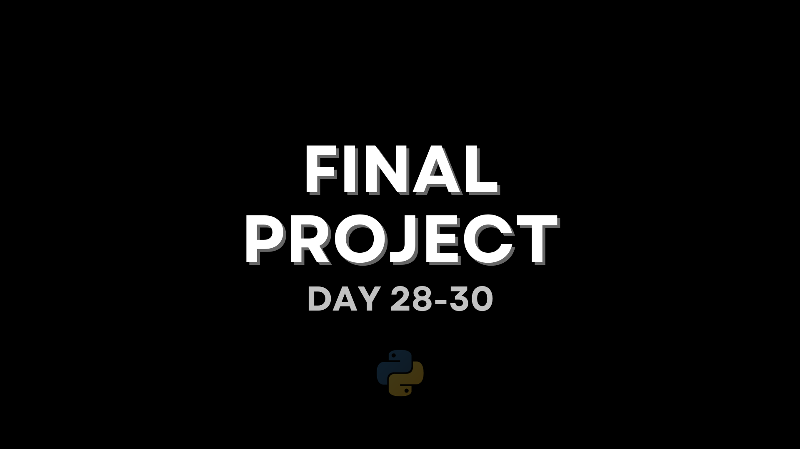</a><h4 align='center'><a href='backend/day-28'>FINAL PROJECT</a></h4>
 |